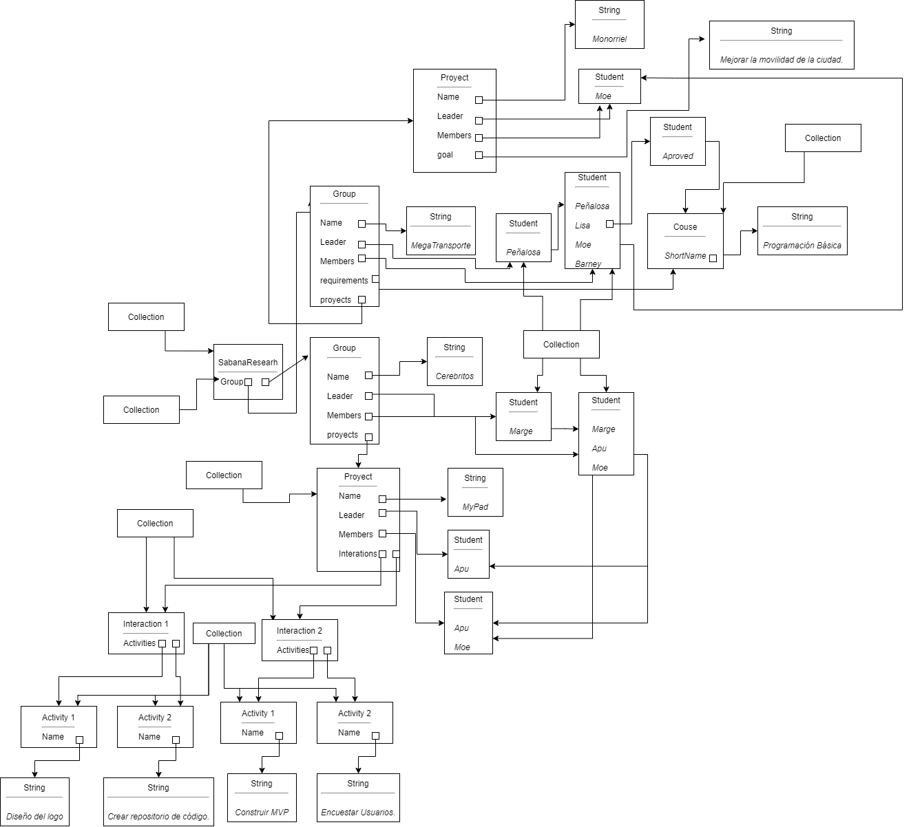

 # POOB-TEST-FIRST-SABANA-RESEARCH

 ## Diego Alejandro Prado Prieto

 ## Diagrama de Memoria

 

 ### Conceptos

 ¿Qué es encapsulamiento? ¿Qué ventajas ofrece?

 ¿Qué es ocultación de información? ¿Por qué aplicarla? ¿Cómo se implementa en Java?
